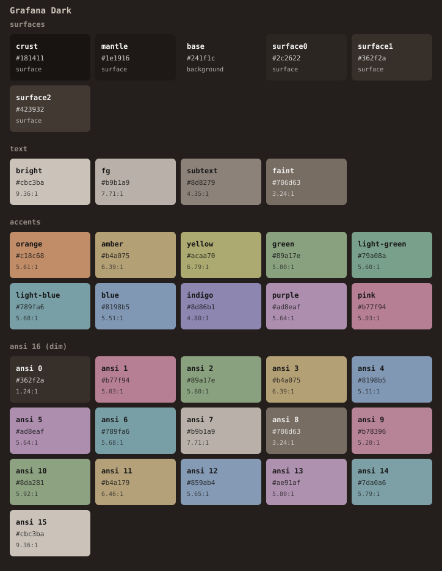
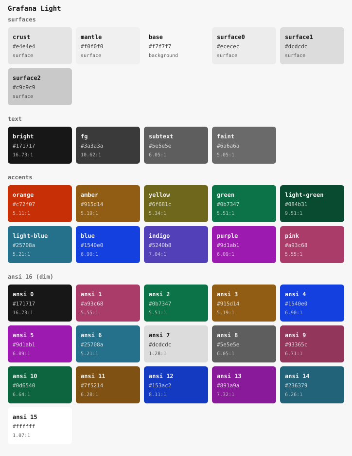
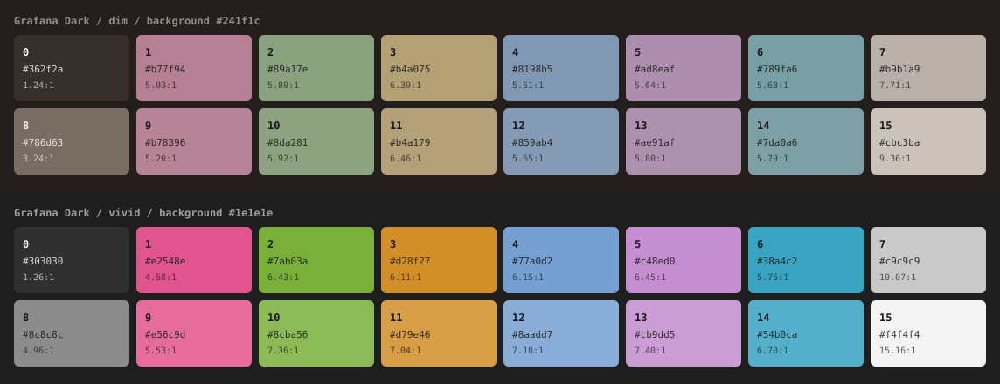

# Grafana color scheme

One palette, derived from the Grafana Labs brand colors, ported to 11 tools.
Warm gray surfaces and muted Grafana accents, inspired by Nord.





[](LICENSE)

> **Not an official Grafana Labs project.** "Grafana" is a trademark of
> Grafana Labs; this repository is an independent port of their brand palette
> and is not affiliated with or endorsed by them. See [NOTICE](NOTICE).

## About

Two variants, `grafana-dark` and `grafana-light`, generated from a single
source of truth ([`palette.toml`](palette.toml)) by one dependency-free
script. The generated files are committed, so you can download the one file
your tool needs and never run anything.

The scheme started life as the syntax highlighting for
[www.ymotongpoo.com](https://www.ymotongpoo.com) and was generalized from
there.

## Palette

### Base colors

Taken verbatim from the Grafana Labs brand guide. These are never edited to
fix a contrast problem; the variants are.

<!-- BEGIN GENERATED: brand -->
| brand color   | hex       | group     |
|---------------|-----------|-----------|
| `orange`      | `#ff671d` | primary   |
| `white`       | `#ffffff` | secondary |
| `black`       | `#000000` | secondary |
| `yellow`      | `#ffed23` | secondary |
| `green`       | `#04bc4c` | secondary |
| `blue`        | `#2970ff` | secondary |
| `purple`      | `#d444f1` | secondary |
| `amber`       | `#ffab29` | support   |
| `light-green` | `#91d441` | support   |
| `light-blue`  | `#3fc6eb` | support   |
| `indigo`      | `#7d64ff` | support   |
| `pink`        | `#f35998` | support   |
| `neutral-1`   | `#f4f4f4` | neutral   |
| `neutral-2`   | `#afafaf` | neutral   |
| `neutral-3`   | `#696969` | neutral   |
| `neutral-4`   | `#3a3a3a` | neutral   |
| `neutral-5`   | `#171717` | neutral   |
<!-- END GENERATED: brand -->

The brand also publishes tint and shade ladders for five hues. The light
variant draws most of its accents from the 140–180% steps.

<!-- BEGIN GENERATED: ladders -->
| hue      | 20%       | 40%       | 60%       | 80%       | 100%      | 120%      | 140%      | 160%      | 180%      |
|----------|-----------|-----------|-----------|-----------|-----------|-----------|-----------|-----------|-----------|
| `orange` | `#fee9d4` | `#ffd0a7` | `#ffad70` | `#ff8137` | `#ff671d` | `#f04205` | `#c72f07` | `#9d250e` | `#7f230f` |
| `yellow` | `#fcffd2` | `#fffea8` | `#fff86b` | `#feed55` | `#fbe136` | `#fdc809` | `#cf9304` | `#aa710e` | `#915d14` |
| `green`  | `#d7f9e3` | `#aaf0c7` | `#72e1a6` | `#54d192` | `#18b16a` | `#0c9065` | `#0b7347` | `#0a5b39` | `#084b31` |
| `blue`   | `#d9e7ff` | `#bbd8ff` | `#8dc0ff` | `#599bff` | `#2870ff` | `#1b55f5` | `#1540e0` | `#1734b6` | `#1a308f` |
| `purple` | `#f9e8fe` | `#f3ceff` | `#eeaafd` | `#e477fb` | `#d444f0` | `#bb23d5` | `#9d1ab1` | `#831790` | `#6e1976` |
<!-- END GENERATED: ladders -->

Two things worth knowing about the source data:

- **The 100% step of a ladder is not always the secondary color of the same
  name.** The guide lists green as `#04bc4c` but centers its ladder on
  `#18b16a`; yellow is `#ffed23` against a ladder center of `#fbe136`; blue
  and purple differ in the last digit. Both sets are reproduced faithfully in
  `palette.toml`, and the ladders are what the variants are built from.
- **There is no red.** See [below](#there-is-no-red).

### Derivation

The default palette uses warm gray surfaces and muted versions of Grafana's
hues, inspired by [Nord's pastel colors](https://www.nordtheme.com/docs/colors-and-palettes/).

- **Dark** uses `#241f1c` for the background, with a subtle orange tint.
- **Light** uses `#e8e1d9`, with softened text and accents on a warm gray background.

The colors are hand-tuned for their appearance together. Reading palettes
have no minimum contrast requirement. See [docs/derivation.md](docs/derivation.md)
for the palette and flavor design.

### Dark

<!-- BEGIN GENERATED: palette-dark -->
| token         | hex       | brand origin            | contrast on `#241f1c` |
|---------------|-----------|-------------------------|-----------------------|
| `orange`      | `#c18c68` | orange 80%; hand-muted  | 5.61:1                |
| `amber`       | `#b4a075` | amber; hand-muted       | 6.39:1                |
| `yellow`      | `#acaa70` | yellow 100%; hand-muted | 6.79:1                |
| `green`       | `#89a17e` | light green; hand-muted | 5.80:1                |
| `light-green` | `#79a08a` | green 80%; hand-muted   | 5.60:1                |
| `light-blue`  | `#789fa6` | light blue; hand-muted  | 5.68:1                |
| `blue`        | `#8198b5` | blue 60%; hand-muted    | 5.51:1                |
| `indigo`      | `#8d86b1` | indigo; hand-muted      | 4.80:1                |
| `purple`      | `#ad8eaf` | purple 60%; hand-muted  | 5.64:1                |
| `pink`        | `#b77f94` | pink; hand-muted        | 5.03:1                |
<!-- END GENERATED: palette-dark -->

### Light

<!-- BEGIN GENERATED: palette-light -->
| token         | hex       | brand origin            | contrast on `#e8e1d9` |
|---------------|-----------|-------------------------|-----------------------|
| `orange`      | `#ac795a` | orange 140%; hand-muted | 2.87:1                |
| `amber`       | `#a08a61` | yellow 180%; hand-muted | 2.57:1                |
| `yellow`      | `#989363` | yellow; hand-muted      | 2.42:1                |
| `green`       | `#7d9068` | green 140%; hand-muted  | 2.67:1                |
| `light-green` | `#6f9381` | green 180%; hand-muted  | 2.63:1                |
| `light-blue`  | `#719399` | light blue; hand-muted  | 2.56:1                |
| `blue`        | `#7b8da5` | blue 140%; hand-muted   | 2.62:1                |
| `indigo`      | `#8a80aa` | indigo; hand-muted      | 2.82:1                |
| `purple`      | `#a183a2` | purple 140%; hand-muted | 2.58:1                |
| `pink`        | `#ac7b8d` | pink; hand-muted        | 2.71:1                |
<!-- END GENERATED: palette-light -->

### Surfaces and text

Surfaces are **two ladders diverging from `base`**, not one chain:

- shadow: `base` → `mantle` → `crust`
- elevation: `base` → `surface0` → `surface1` → `surface2`

In the light variant this matters — `mantle` is lighter than `surface0`, and
`crust` sits between `surface0` and `surface1` — so treating the six as a
single ordering will give you the wrong answer.

<!-- BEGIN GENERATED: surfaces -->
| token      | dark               | light              |
|------------|--------------------|--------------------|
| `crust`    | `#181411`          | `#d2c8bd`          |
| `mantle`   | `#1e1916`          | `#e0d7cd`          |
| `base`     | `#241f1c`          | `#e8e1d9`          |
| `surface0` | `#2c2622`          | `#e0d5ca`          |
| `surface1` | `#362f2a`          | `#d3c5b8`          |
| `surface2` | `#423932`          | `#c4b2a2`          |
| `bright`   | `#cbc3ba` (9.36:1) | `#574e47` (6.27:1) |
| `fg`       | `#b9b1a9` (7.71:1) | `#6b625b` (4.60:1) |
| `subtext`  | `#8d8279` (4.35:1) | `#928579` (2.77:1) |
| `faint`    | `#786d63` (3.24:1) | `#a89b8e` (2.09:1) |
<!-- END GENERATED: surfaces -->

### Semantic roles

Every port maps its own token names onto these roles, so changing a role here
changes all 11 targets at once. The `token` column is the palette color the
role points at.

<!-- BEGIN GENERATED: roles -->
| role                 | token         | dark      | light     | style         |
|----------------------|---------------|-----------|-----------|---------------|
| `keyword`            | `orange`      | `#c18c68` | `#ac795a` | -             |
| `keyword-ctrl`       | `orange`      | `#c18c68` | `#ac795a` | -             |
| `keyword-op`         | `orange`      | `#c18c68` | `#ac795a` | -             |
| `operator`           | `orange`      | `#c18c68` | `#ac795a` | -             |
| `builtin`            | `amber`       | `#b4a075` | `#a08a61` | -             |
| `decorator`          | `amber`       | `#b4a075` | `#a08a61` | -             |
| `string`             | `green`       | `#89a17e` | `#7d9068` | -             |
| `string-doc`         | `green`       | `#89a17e` | `#7d9068` | italic        |
| `string-escape`      | `amber`       | `#b4a075` | `#a08a61` | -             |
| `regex`              | `pink`        | `#b77f94` | `#ac7b8d` | -             |
| `number`             | `light-blue`  | `#789fa6` | `#719399` | -             |
| `boolean`            | `light-blue`  | `#789fa6` | `#719399` | -             |
| `constant`           | `light-blue`  | `#789fa6` | `#719399` | -             |
| `type`               | `blue`        | `#8198b5` | `#7b8da5` | -             |
| `class`              | `blue`        | `#8198b5` | `#7b8da5` | -             |
| `namespace`          | `blue`        | `#8198b5` | `#7b8da5` | -             |
| `interface`          | `blue`        | `#8198b5` | `#7b8da5` | -             |
| `function`           | `purple`      | `#ad8eaf` | `#a183a2` | -             |
| `method`             | `purple`      | `#ad8eaf` | `#a183a2` | -             |
| `variable`           | `fg`          | `#b9b1a9` | `#6b625b` | -             |
| `parameter`          | `fg`          | `#b9b1a9` | `#6b625b` | -             |
| `property`           | `light-green` | `#79a08a` | `#6f9381` | -             |
| `attribute`          | `amber`       | `#b4a075` | `#a08a61` | -             |
| `tag`                | `orange`      | `#c18c68` | `#ac795a` | -             |
| `label`              | `amber`       | `#b4a075` | `#a08a61` | -             |
| `preprocessor`       | `indigo`      | `#8d86b1` | `#8a80aa` | -             |
| `punctuation`        | `subtext`     | `#8d8279` | `#928579` | -             |
| `comment`            | `subtext`     | `#8d8279` | `#928579` | italic        |
| `comment-doc`        | `subtext`     | `#8d8279` | `#928579` | italic        |
| `link`               | `light-blue`  | `#789fa6` | `#719399` | underline     |
| `heading`            | `orange`      | `#c18c68` | `#ac795a` | bold          |
| `deprecated`         | `faint`       | `#786d63` | `#a89b8e` | strikethrough |
| `diagnostic.error`   | `pink`        | `#b77f94` | `#ac7b8d` | -             |
| `diagnostic.warning` | `amber`       | `#b4a075` | `#a08a61` | -             |
| `diagnostic.info`    | `blue`        | `#8198b5` | `#7b8da5` | -             |
| `diagnostic.hint`    | `subtext`     | `#8d8279` | `#928579` | -             |
| `diagnostic.ok`      | `green`       | `#89a17e` | `#7d9068` | -             |
| `diff.added`         | `green`       | `#89a17e` | `#7d9068` | -             |
| `diff.removed`       | `pink`        | `#b77f94` | `#ac7b8d` | -             |
| `diff.changed`       | `yellow`      | `#acaa70` | `#989363` | -             |
<!-- END GENERATED: roles -->

See [docs/roles.md](docs/roles.md) for the reasoning behind individual
assignments.

### ANSI 16

The single highest-leverage table in the repo: WezTerm, iTerm2, tmux, Zed's
`terminal.ansi.*`, VS Code's `terminal.ansi*`, Vim's `g:terminal_ansi_colors`
and Herdr's `terminal` mode all consume it.

<!-- BEGIN GENERATED: ansi -->
| slot | name           | dark dim  | dark vivid | light dim | light vivid |
|------|----------------|-----------|------------|-----------|-------------|
| 0    | black          | `#362f2a` | `#303030`  | `#574e47` | `#171717`   |
| 1    | red            | `#b77f94` | `#e2548e`  | `#ac7b8d` | `#a93c68`   |
| 2    | green          | `#89a17e` | `#7ab03a`  | `#7d9068` | `#0b7347`   |
| 3    | yellow         | `#b4a075` | `#d28f27`  | `#a08a61` | `#915d14`   |
| 4    | blue           | `#8198b5` | `#77a0d2`  | `#7b8da5` | `#1540e0`   |
| 5    | magenta        | `#ad8eaf` | `#c48ed0`  | `#a183a2` | `#9d1ab1`   |
| 6    | cyan           | `#789fa6` | `#38a4c2`  | `#719399` | `#25708a`   |
| 7    | white          | `#b9b1a9` | `#c9c9c9`  | `#d3c5b8` | `#dcdcdc`   |
| 8    | bright black   | `#786d63` | `#8c8c8c`  | `#928579` | `#5e5e5e`   |
| 9    | bright red     | `#b78396` | `#e56c9d`  | `#a77989` | `#93365c`   |
| 10   | bright green   | `#8da281` | `#8cba56`  | `#7c8c67` | `#0d6540`   |
| 11   | bright yellow  | `#b4a179` | `#d79e46`  | `#9c8761` | `#7f5214`   |
| 12   | bright blue    | `#859ab4` | `#8aadd7`  | `#7a8a9f` | `#153ac2`   |
| 13   | bright magenta | `#ae91af` | `#cb9dd5`  | `#9d809c` | `#891a9a`   |
| 14   | bright cyan    | `#7da0a6` | `#54b0ca`  | `#718f94` | `#236379`   |
| 15   | bright white   | `#cbc3ba` | `#f4f4f4`  | `#efe8e0` | `#ffffff`   |
<!-- END GENERATED: ansi -->



Dark and light have different ANSI mappings. Slot 0 must differ from the
background. Dim slots 9–14 blend their normal color 8% toward `text.fg` in
sRGB; light dim slot 15 is a softened ivory (`#efe8e0`).

### There is no red

The Grafana brand palette has no red. Rather than invent one, the roles that
conventionally want red are mapped onto colors the brand does have:

| role | mapped to | why |
|---|---|---|
| `error`, `diff.removed`, `regex` | `pink` | the most red-adjacent brand hue, and distinct from `orange` at every step of both ladders |
| `warning` | `amber` | already the brand's caution color |

The one place this leaks is Herdr, whose token vocabulary hard-codes the name
`red`; that file sets `red` to our pink and says so in a comment.

### Browser chrome

The Chrome theme does not use the syntax accents. Browser chrome is a
branding surface, so `[variants.*.browser]` carries a separate `key` /
`key_alt` / `key_accent` / `on_key` set: the undimmed brand orange goes on
the frame and toolbar, and `on_key` flips to whichever of near-black or
white clears AA on top of it. See
[targets/chrome/README.md](targets/chrome/README.md).

### Palette checks

Reading palettes have no WCAG minimum contrast requirement; the ratios in
these tables describe the colors, rather than acting as pass/fail thresholds.
Chrome retains its separate browser contrast checks.

`python3 tools/generate.py --verify` checks both flavors for valid colors,
resolved roles, complete ANSI tables, and ordered surface ladders. It also
requires accents to remain at least CIE76 ΔE 8 apart, so adjacent hues retain
some separation after dimming. These rules live in `palette.toml`.

## Install

<!-- BEGIN GENERATED: install -->
| tool          | files                                | artifacts                                       | install                                                                             |
|---------------|--------------------------------------|-------------------------------------------------|-------------------------------------------------------------------------------------|
| VS Code       | [`targets/vscode`](targets/vscode)   | extension root with 2 theme files               | symlink `targets/vscode` into `~/.vscode/extensions/`, restart, then pick the theme |
| Zed           | [`targets/zed`](targets/zed)         | 1 theme family (both variants)                  | copy `themes/grafana.json` to `~/.config/zed/themes/`                               |
| Emacs         | [`targets/emacs`](targets/emacs)     | 2 theme files                                   | add the directory to `custom-theme-load-path`, then `(load-theme 'grafana-dark t)`  |
| Vim / Neovim  | [`targets/vim`](targets/vim)         | 2 colorschemes                                  | add `targets/vim` to `runtimepath`, then `:colorscheme grafana-dark`                |
| WezTerm       | [`targets/wezterm`](targets/wezterm) | 4 TOML schemes (+ vivid)                        | copy `colors/*.toml` to `~/.config/wezterm/colors/`, then set `color_scheme`        |
| iTerm2        | [`targets/iterm2`](targets/iterm2)   | 4 color presets (+ vivid)                       | Settings > Profiles > Colors > Color Presets > Import                               |
| tmux          | [`targets/tmux`](targets/tmux)       | 2 themes, optional status line, TPM entry point | `source-file` the conf from `~/.tmux.conf`, or install via TPM                      |
| Herdr         | [`targets/herdr`](targets/herdr)     | 2 config fragments                              | paste the `[theme.custom]` block into `~/.config/herdr/config.toml`                 |
| Chroma / Hugo | [`targets/chroma`](targets/chroma)   | 2 XML styles, 3 stylesheets                     | Hugo: copy a CSS file and set `markup.highlight.noClasses = false`                  |
| Slack         | [`targets/slack`](targets/slack)     | 2 sidebar strings                               | Preferences > Themes, paste the string into the custom theme field                  |
| Chrome        | [`targets/chrome`](targets/chrome)   | 2 unpacked themes                               | `chrome://extensions` > Developer mode > Load unpacked                              |
<!-- END GENERATED: install -->

Each directory has its own README with the full steps and any per-tool
caveats. The directories are shaped the way each tool expects, so
`targets/vim` works as a `runtimepath` entry, `targets/vscode` as an
extension root, and so on.

## Terminal flavors

WezTerm and iTerm2 ship two complete flavors:

- **dim** (the default, unsuffixed) uses the warm gray palette shared with
  the editors. ANSI slots match the terminals embedded in those editors.
- **vivid** (`-vivid`) preserves the previous default palette, including its
  backgrounds, text, accents, cursor, selection, UI colors, and all 16 ANSI
  colors. Choose it to keep the appearance of the old unsuffixed theme.

The former Vivid palette with undimmed brand brights is replaced by this
preserved default. Theme names and filenames are unchanged.

## Regenerate

```sh
python3 tools/generate.py            # rewrite every target and the doc tables
python3 tools/generate.py --verify   # palette invariants and browser contrast
python3 tools/generate.py --check    # fail if anything on disk is stale
python3 tools/generate.py --list     # registered targets
python3 -m unittest discover -s tools/tests  # flavor regression tests
```

Requires Python 3.11 or newer (for `tomllib`) and nothing else.

**Never hand-edit anything under `targets/`** — edit `palette.toml` and
regenerate. `--check` reports staleness, missing files and orphans left
behind by renames.

Adding a twelfth target is three steps; see
[docs/adding-a-target.md](docs/adding-a-target.md).

## Roadmap

- CI running `--check` and `--verify` on every push
- Submit the `.itermcolors` to
  [mbadolato/iTerm2-Color-Schemes](https://github.com/mbadolato/iTerm2-Color-Schemes),
  which auto-generates ~40 more formats and is where WezTerm syncs its
  bundled schemes from
- Upstream `styles/grafana-*.xml` to
  [alecthomas/chroma](https://github.com/alecthomas/chroma), which would let
  Hugo select the style by name and make the bundled CSS unnecessary
- Upstream the palette to Herdr's built-in theme list
- A Neovim Lua module, plus Alacritty / Ghostty / Kitty / Helix
- Screenshots of real editors

Marketplace publishing (VS Code Marketplace, Open VSX, Chrome Web Store, Zed
extensions) is deliberately out of scope for now: a store listing under the
Grafana name is a different trademark question than a GitHub repository.

## License

[Apache License 2.0](LICENSE). See [NOTICE](NOTICE) for attribution and the
trademark disclaimer.
